# RuyiSDK VSCode 测试报告

### 测试环境：Linux

### 测试的版本：[ruyisdk-vscode-extension](https://github.com/ruyisdk/ruyisdk-vscode-extension/actions/runs/19812469918"可选的标题")

## RuyiSDK安装与准备：

### 安装：

下载[ruyisdk-vscode-extension](https://github.com/ruyisdk/ruyisdk-vscode-extension/actions/runs/19812469918"可选的标题")压缩包，解压获得 ruyisdk-vscode-extension-<version>.vsix，打开vscode，进入插件入口，选择从VSIX安装。

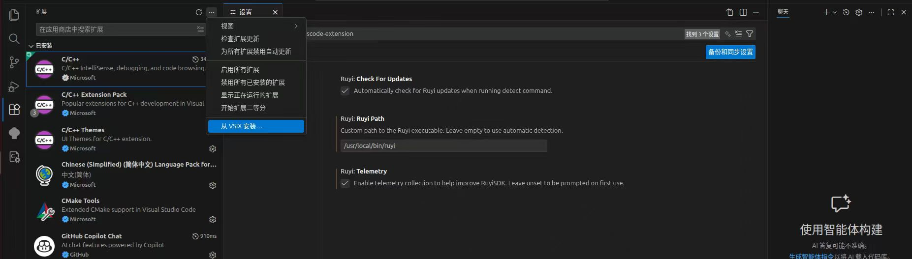

## Ruyi 包管理器版本管理与引导安装：

### 未安装：

未安装 Ruyi 包管理器时，出现“Ruyi not found”的提示，并且能够正常安装。
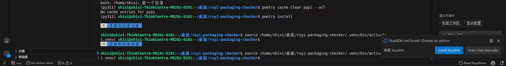

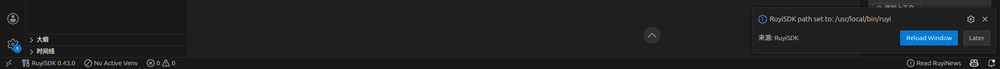

### 多版本管理：

在安装多版本 Ruyi 包管理器时，可以自由切换版本。

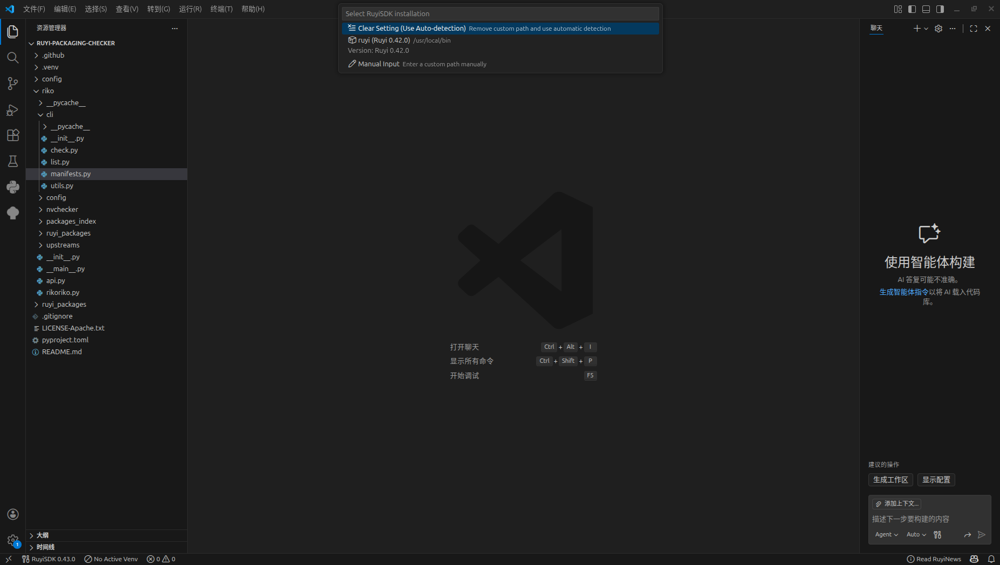

## 新闻（Ruyi News）功能测试：

### 入口：

通过点击右下角的 Read RuyiNews 即可进入入口。

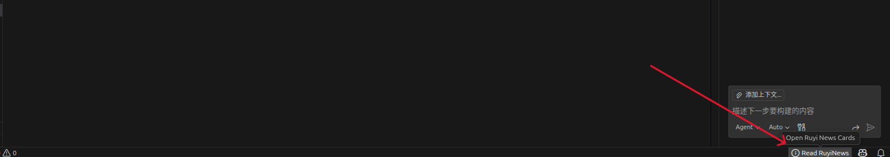

### 打开新闻界面：

可以看到图中的新闻卡片。其中，在该界面中，有蓝色长条标记的是未读的新闻。

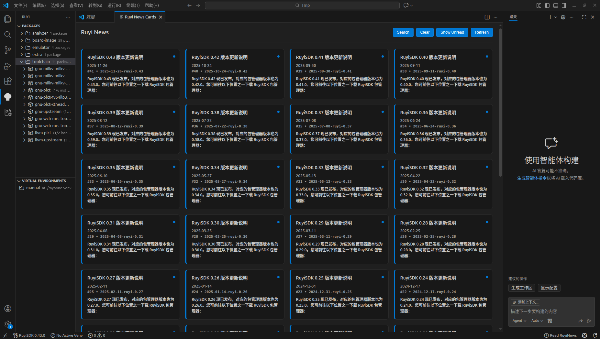

### 阅读新闻：

点击新闻卡片，开启新的标签页，即可阅读新闻。

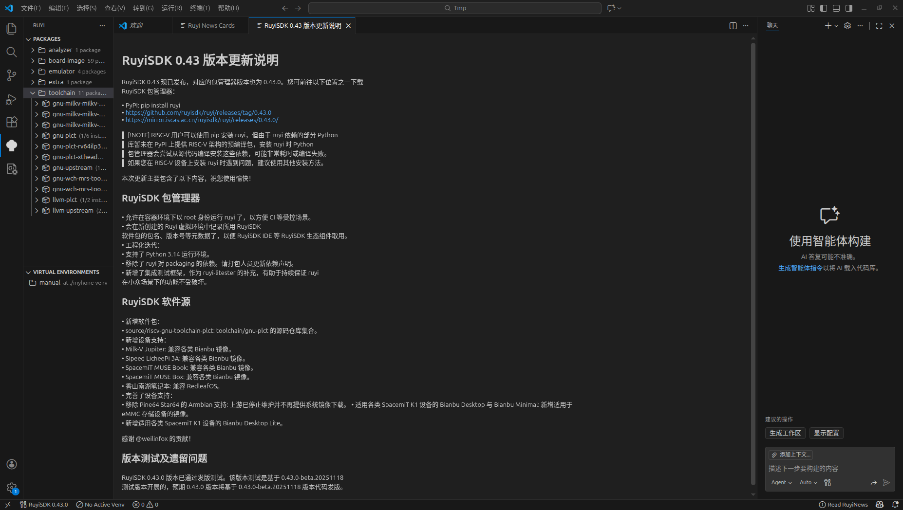

### 已读标记：

当新闻被阅读时，新闻所在的卡片的蓝色长条消失，如图中的左上角第一张卡片。

### 搜索关键词：

点击图中蓝色的 Search 按钮即可进行搜索，搜索栏在上方，图中输入的关键词是 0.42，搜索结果显示在下方。

注：该过程可能存在延迟。

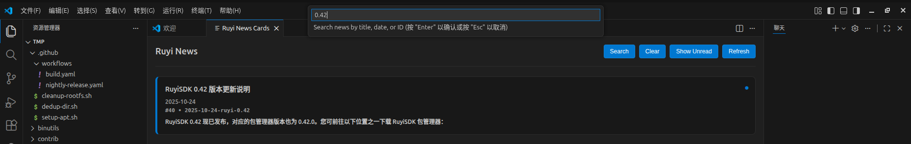

### 切换“仅未读”：

点击 Show Unread 按钮，展示仅未读的新闻，同时 Show Unread 按钮中的文本信息变为 Show All。
注：该过程可能存在延迟。

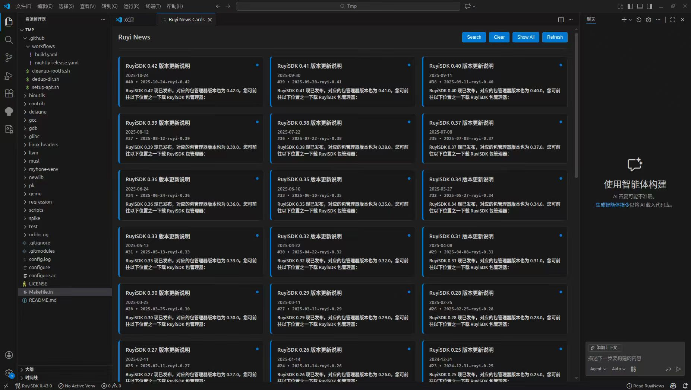

### 手动刷新：

点击 Refresh 按钮，进行手动刷新，右下角提示刷新成功。

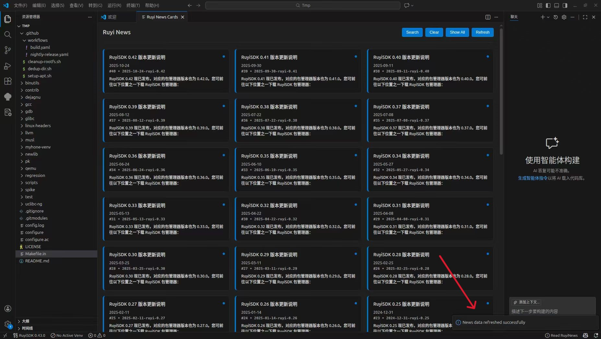

### 异常：

偶尔在打开新闻界面时会出现，下面的情况。

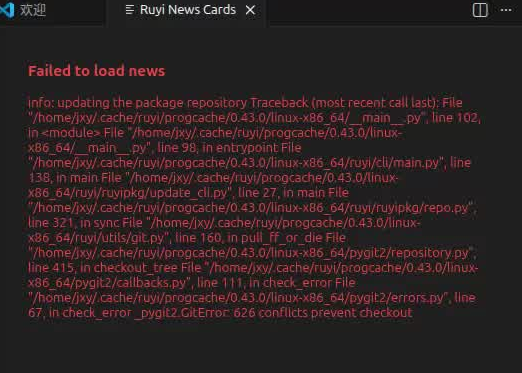

## 包管理：

### 入口：

点击左侧的 Ruyi 选项卡，进入入口。

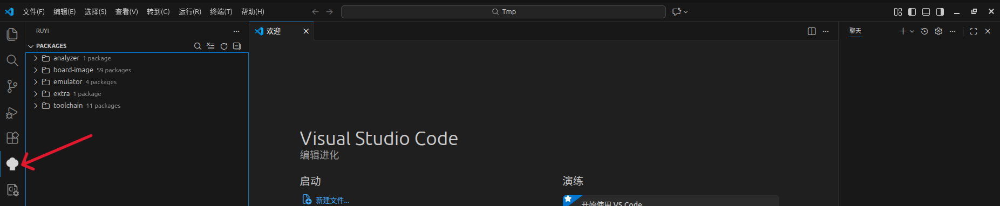

### 安装包与查看进度：

安装包，如图所示，图片示例安装的是 17.0.6-ruyi.20240511 ，安装过程中有完整的安装指引，安装成功后有“安装成功”的提示。
注：某些包较大，可能需要较长的安装时间。

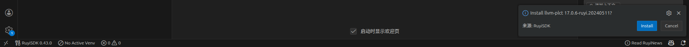

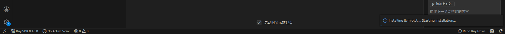

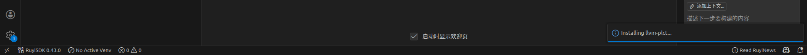

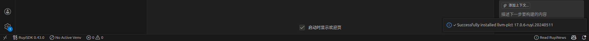

### 安装错误提示：

由于某些原因，安装过程可能会出现错误，左下角有“安装失败”的信息提示，方便进行排查。

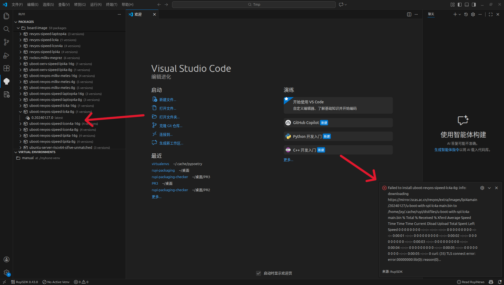

## 虚拟环境管理：

### 入口与检测：

进入后成功检测到已经存在的虚拟环境。

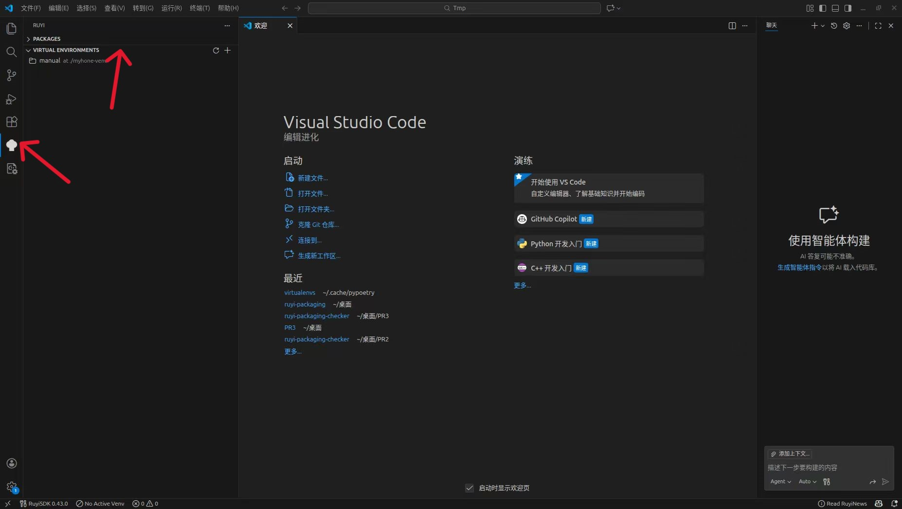

### 创建虚拟环境：

如图所示点击加号，开始创建虚拟环境。

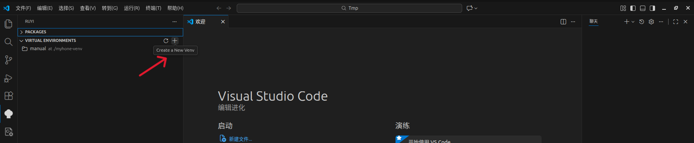

按照提示一步步进行操作：
其中图中红色标记是图中示例的选择。

1.选择 profile。

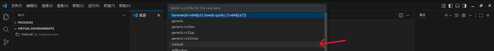

2.选择一个 toolchain。

注意，在选择 toolchain 时，不当的选择（如仅选择llvm-plct）可能会照成8.中的错误。

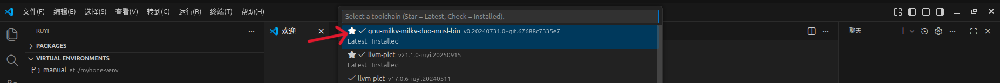

3.选择更多的toolchain，图例跳过（ESC）。

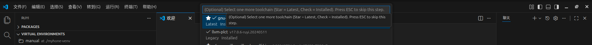

4.选择 emulator。

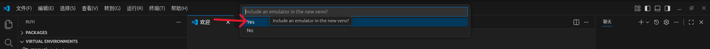

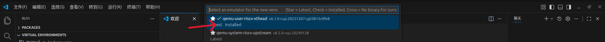

5.给虚拟环境取名，图例manual2。

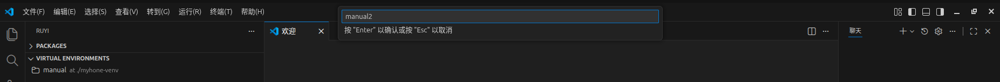

6.设置路径，图例./myhone-venv2。

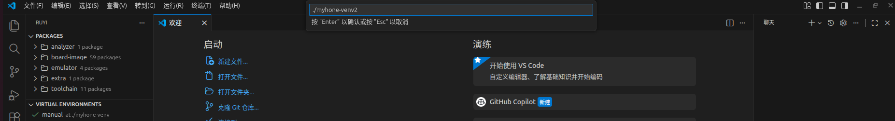

7.进一步选择，图例全部跳过（ESC）。

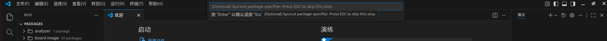

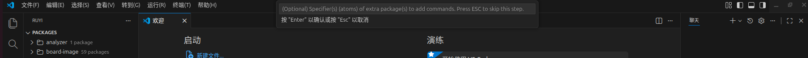

8.可能出现的错误。

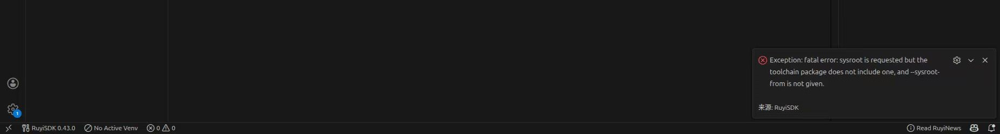

## 解压项目模板与编译：

### 入口：

Explorer 面板文件树右键。

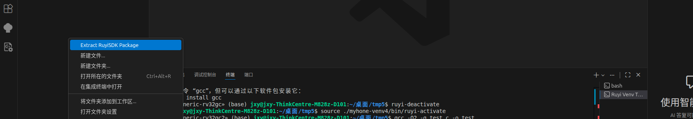

### 选择模板：

本例选择的是 ruyisdk-demo。

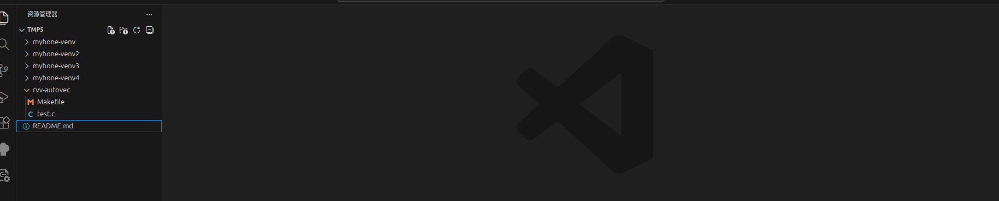

### 结合已创建的虚拟环境与所选 toolchain 进行编译：

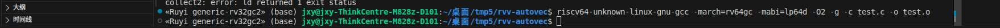

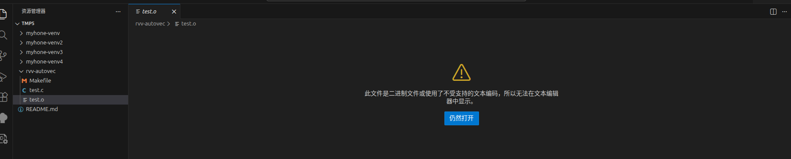

## 插件设置：

入口：Extensions 页面选中 RuyiSDK 点击 settings。
显示正常。

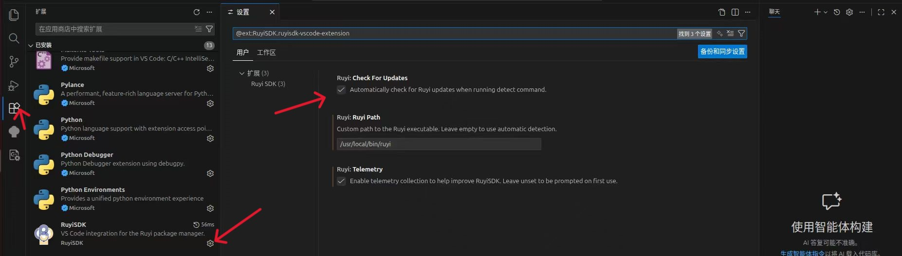

